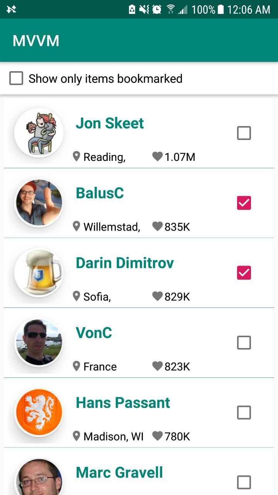
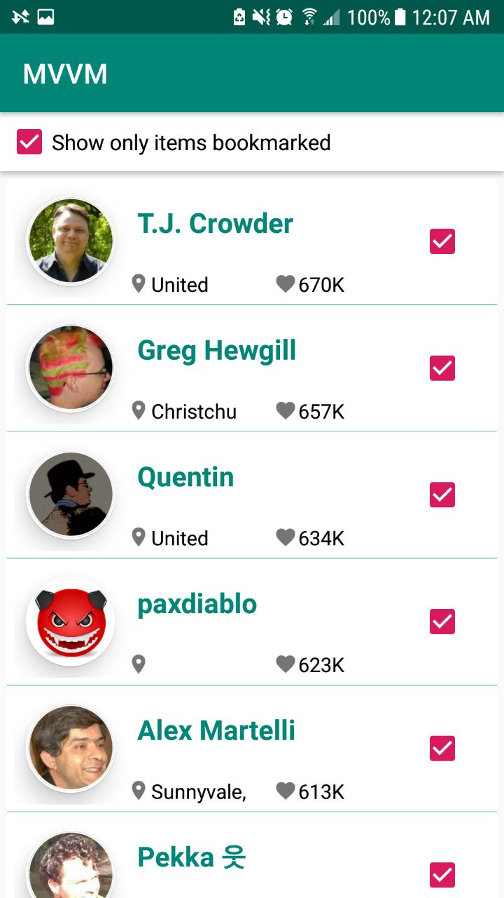

# MVVMCleanArchitecture
## What's PROJECT?
This repository contains a detailed sample app that implements MVVM architecture using Koin, Room, RxJava
### The app has following packages:
1. **data**: It contains all the data accessing and manipulating components.
2. **di**: Dependency providing classes using Koin.
3. **domain**: All usecase of application
4. **ui**: View classes along with their corresponding ViewModel ,dialog and adapter of views.
5. **utils**: Utility classes.

  
  

 

### Feature of App
1. List out all of SOF(StackOverFlow) user list. User must be able to scroll down to see all of SOF user.
2. User can bookmark / de-bookmark a SOF user.
3. Provide option for user to see only SOF user that has been bookmarked.
4. User can click on any SOF user to see their detail reputation.

In this repository you will found samples project to help you understand how to use Koin with several technologies.

#### [Android MVVM StackOverflow Users app](https://github.com/ninhvanluyen)

An Android app for getting user data from stackOverflow, in MVVM architecture style and RxJava, databinding and Koin
#### Contributing
Any contributions are welcome! Please check the CONTRIBUTING guideline before submitting a new issue. Wanna send PR?

#### License

    Copyright 2016 "ninhvanluyen <luyenninhvan@gmail.com>"

    Licensed under the Apache License, Version 2.0 (the "License");
    you may not use this file except in compliance with the License.
    You may obtain a copy of the License at

        http://www.apache.org/licenses/LICENSE-2.0

    Unless required by applicable law or agreed to in writing, software
    distributed under the License is distributed on an "AS IS" BASIS,
    WITHOUT WARRANTIES OR CONDITIONS OF ANY KIND, either express or implied.
    See the License for the specific language governing permissions and
    limitations under the License.

