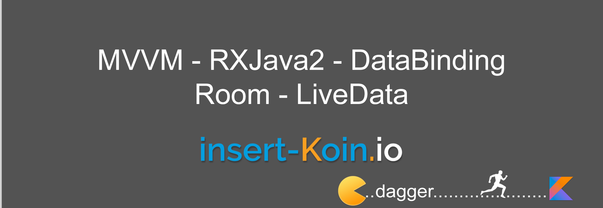

# MVVMCleanArchitechture
## What's KOIN?

Koin is a small library to lets you write dependency injection in a concise and pragmatic way. No proxy, no code generation, no introspection. Just DSL and functional Kotlin magic!

#### *Declare, Start & Inject*

## insert-koin.io

#### All documentation, sample and references has been move to our website. Check the official website to get started: [insert-koin.io](https://insert-koin.io)

## Koin Samples

In this repository you will found samples project to help you understand how to use Koin with several technologies.

#### [Android MVVM StackOverflow Users app](https://github.com/ninhvanluyen)

An Android app for getting user data from stackOverflow, in MVVM architecture style and RxJava, databinding and Koin

#### [Kotlin standalone app](linkapk --updating)

## Follow us & Contact

### Medium - [Koin Developers Hub](https://medium.com/koin-luyen-developer)

